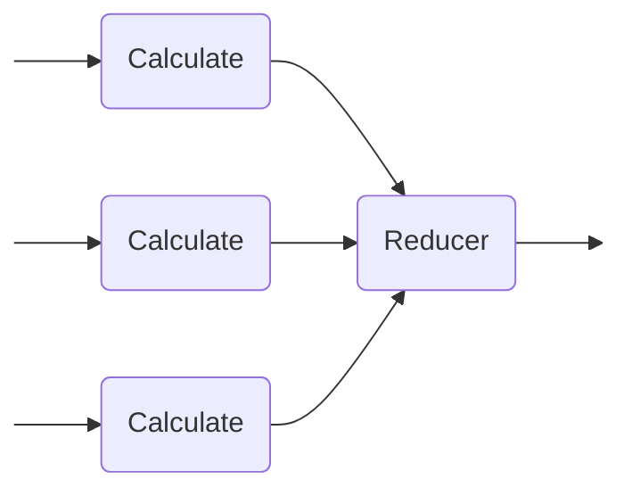

# Measuring Energy-Efficiency of Parallel Programs

## Quick-Start
```sh
    make file=examples/prime_count.cpp build
    sudo ./energy-effi
```
The results of the measurement can be found in `out.csv`.

## Concept
This programs allows for measuring the time- and energy-usage of parallel programs written in C++ while also providing a visualization.
For this, it uses a variation of the [Map-Reduce-Framework](https://en.wikipedia.org/wiki/MapReduce):


Each of the `Calculate`Functions, running in parallel can be assigned to a part of the whole task based on their thread-number. The `Reducer` waits for all calculations being finished to then combine the partial Results into a single one. Note, that no input-data is passed into each of the `Calculate` function, meaning that they need to access the data from some shared data-state. This was done to prevent the need of copying data resulting in more overhead.

### Example: Array-Sum
As an example, take the problem of summing over an array using 4 parallel workers. In this case, `Calculate` `i` takes the i'th fourth of the Array and calculate the sum over this sub-array. The Reducer would then sum up the results of the Calculators.

## Usage

To measure another program besides the provided examples, one first needs to implement the three components, Mapper, Calculator and Reduce for this specific problem in C++. The templated signatures for this are as follows:
```C++
T calculate(size_t thread_number, size_t total_thread_number);
T reduce(size_t total_thread_number, T partial_result, R final_result);
```

The header `parallel.hpp` provides two functions to be used:
```C++
ResultT run(
    PartialResultT (*)(size_t thread_id, size_t total_threads) calculate,
    void (*)(size_t thread_count, PartialResultT partial_result, ResultT& result) reduce,
    size_t max_threads,
);
void benchmark(
    PartialResultT (*)(size_t thread_id, size_t total_threads) calculate,
    void (*)(size_t thread_count, PartialResultT partial_result, ResultT& result) reduce,
    size_t sample_size,
    size_t max_threads,
    std::string output_file_name
);
```
where `calculate` and `reduce` match the signatures of the above functions. `run` can be called to execute the program on the given number of threads while retrieving the result.
`benchmark` on the other side can be used to run benchmarks against the provided program. For this, it runs the program on 2 to `max_threads` threads, each for `sample_size` times, resulting in `(max_threads - 1) * sample_size` pairs of time- and energy-measurements. It writes the result in form of a CSV file into `output_file_name` to be used for visualizations.
