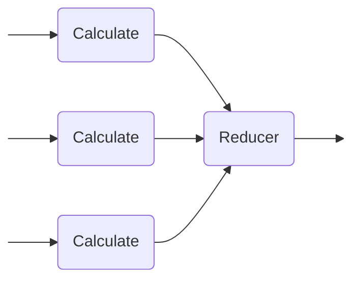

# Parallel Energy Toolkit

A C++ toolkit designed to measure the trade-off between **execution time** and **energy consumption** in parallel programs. Built upon the principles of the [energy-toolkit](https://github.com/sse-labs/energy-toolkit), this tool helps developers answering the question of deciding, if using more threads for the workload is worth the potential cost of more energy.

---

## Quick Start

Get the first benchmark running:

> **Note:** Running energy benchmarks usually requires `sudo` to access RAPL register

```sh
# 1. Prepare the Python environment
python3 -m venv .venv
.venv/bin/pip install -r requirements.txt 

# 1. Run the example
make file=examples/prime_count.cpp run args=20000
```
The results will be available in `prime_count.csv` and visualized in `prime_count_plots.png`.

---

## Core Concept

The toolkit uses a variant of the **Map-Reduce** framework optimized for shared-memory parallelism by working on a shard memory:



1.  **Calculate (Map):** The task is split into $N$ threads. Each thread calculates a partial result based on its `thread_id`. Note, that memory accesses are handled by the programmer and use shared memory
2.  **Reduce:** Once all threads finish, a reducer function aggregates those partial results into the final output.

**Example: Array Summation**
If summing an array with 4 threads, each "Calculator" handles 1/4th of the array. The "Reducer" then sums those four sub-totals.

---

## Usage Guide

### 1. Implementing the Logic
To profile an algorithm, one must define two functions following these signatures:

| Function | Signature | Purpose |
| :--- | :--- | :--- |
| **Calculate** | `T calculate(size_t id, size_t total)` | Performs the parallel workload. |
| **Reduce** | `void reduce(size_t total, T partial, R& final)` | Combines a partial result into the final result. |

### 2. Choosing the Execution Mode
The `parallel.hpp` header provides two primary entry points:

#### `run(...)`
Executes the program once with a specific number of threads, which could be for example used for testing if the program outputs correct results:
```cpp
ResultT run(calculate_func, reduce_func, size_t max_threads);
```

#### `benchmark(...)`
It runs the program across a range of thread counts (from 2 up to `max_threads`), repeating the process for a `sample_size` to ensure statistical significance:
```cpp
void benchmark(
    calculate_func, // signature as above
    reduce_func, // signature as above
    size_t sample_size, 
    size_t max_threads, 
    std::string output_file_name
);
```

---

## Visualization

The provided `plot.py` script processes the CSV output to generate three key metrics:
* **Execution Time:** How performance scales with threads.
* **Energy Consumption:** Total Joules consumed per run.
* **Energy-Delay Product (EDP):** Calculated as $Energy \times Time$. This is the "sweet spot" metric—the lower the EDP, the better this specific number of threads.

```bash
# In the venv
python plot.py results.csv
```
---